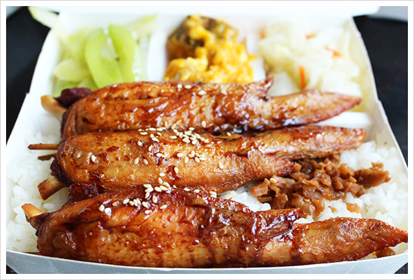

<!doctype html>
<html> 
<head>
<title>十大美食</title>

</head>
<body>
<h1>
<marquee>高雄十大美食</marquee>
</h1>
<h2>1.　經典飲料-老江紅茶</h2>

地址：高雄市左營區裕誠路249號

電話：07-5567701

營業時間：06:30-01:00

<h2>2.　消暑冰品-大碗公冰</h2>

地址：高雄市鼓山區濱海一路107號 

電話：07-5333228

營業時間：10:00–00:00

<h2>3.　酥炸雞排-天使雞排</h2>

地址：崛江：高雄市新興區仁智街262號

電話：0989-216010

地址：瑞豐：高雄瑞豐夜市【第12排號】

電話：0976594881

地址：鳳山：高雄市鳳山區中山路133號

電話：0981068266

營業時間：16:00–01:00

<h2>4.　平民美食-佑佑鍋燒麵</h2>

地址： 高雄市鼓山區裕誠路1511號

電話：07-5866711

營業時間：10:00-14:00 / 17:30-20:00

<h2>5.　家常便當- 正忠排骨飯</h2>

地址： 高雄市新興區中山一路300號

電話：07-2368199

營業時間：10:30-20:30 

<h2>6.　小吃-江豪記臭豆腐</h2>

地址：高雄市新興區民生二路40號

電話：07-2016699

營業時間：11:00-00:00

<h2>7.　韓式料理-玉豆腐</h2>

地址：高雄市前鎮區中華五路1111號

電話：07-5379035

營業時間：11:00-22:00 

<h2>8.　右京棧-酒粕火鍋</h2>

地址：高雄市前金區五福三路25號

電話：07-2015588

營業時間：週一至週四11:00-23:00 / 週五及假日11:00-02:00  

<h2>9.　翰品港飲-港式飲茶</h2>

地址：高雄市鹽埕區大仁路43號3樓

電話：07-5614688#3227

營業時間：11:00–14:00 / 17:00–21:00 

<h2>10.　河邊海鮮-港都海鮮</h2>

地址：高雄市前金區市中一路276號

電話：07-2612168

營業時間：12:00~14:00 / 17:00~21:00 

</body>
</html>

